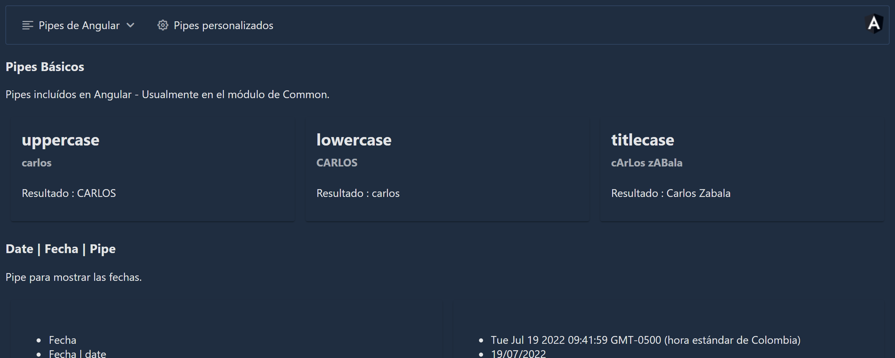

# PipeApp

## Descripción 📖

Proyecto donde se utiliza todos los pipes ofrecidos por Angular, desde los más comunes hasta los menos usados como I18nPluralPipe e I18nSelectPipe, también se crean pipes personalizados.

## Tecnologías utilizadas 🛠

1. **Angular** versión 14.0.0
2. [PrimeNG](https://www.primefaces.org/primeng/) 14.0.0
